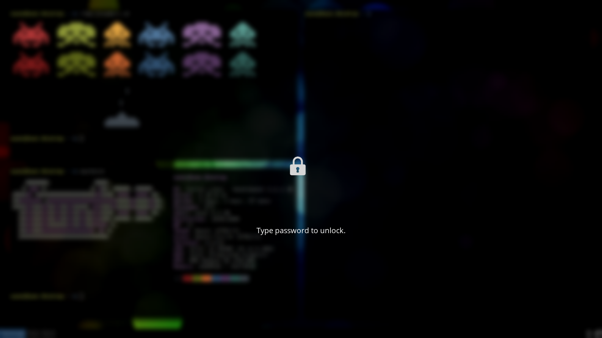

# i3lock-next

`i3lock-next` is a bash script and C helper program much like [i3lock-fancy](https://github.com/meskarune/i3lock-fancy). i3lock-next aims to be much faster by using [Imlib2](https://docs.enlightenment.org/api/imlib2/html/index.html) rather than ImageMagick, and being written (mostly) in C.

**Now with support for multiple monitors!**




## Dependencies

- [i3lock-color](https://github.com/chrjguill/i3lock-color) - a fork of i3lock that supports custom ring colors
- [Imlib2](https://docs.enlightenment.org/api/imlib2/html/)
- [bash](https://www.gnu.org/software/bash/)
- [fontconfig](https://www.freedesktop.org/wiki/Software/fontconfig/)
- [libXrandr](https://www.x.org/wiki/libraries/libxrandr/)

Most of these should be available via the package manager for your distribution.

## Installation

```
$ make
$ make install
```

To use a custom prefix:

```
$ make install PREFIX=/your/custom/prefix
```

## Usage

```
i3lock-next [-h|--help] [font] [size]

Options:
    -h, --help  Display this help text.

    font        Font to to use, default Sans.

    size        Size of font, default 18.
```

### Example:

##### Custom Font:

```
$ i3lock-next "DejaVu Serif" 18
```


##### Default Font:

```
$ i3lock-next
```


